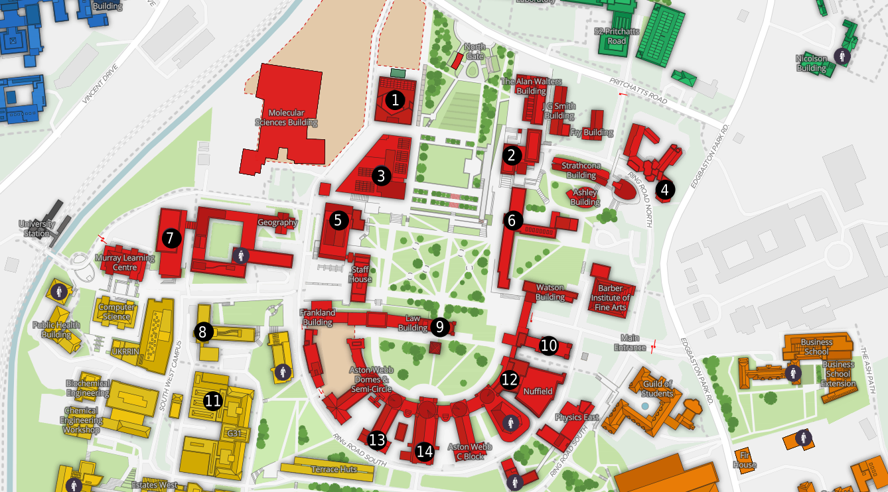

# Gender Neutral Toilets at UoB

## The actual map

## List of locations on map vs what is actually there

1. Teaching and Learning* - This could be the disabled toilet that (I think) are on each floor
2. Muirhead Tower* - No idea on this one, could be there but I've only ever been on the bottom floor
3. The Library* - No idea either, it seems that the toilets on each floor are generally not gender neutral, unless for disabled
4. Education Building* - Not looked for the gender neutral toilet, the marker is weirdly close to the lecture theatre
5. University Centre* - Think this must be somewhere in the corridor between spar and the canteen-y area, though could be downstairs?
6. Arts Building* - Not seen, but know where the gendered toilets are
7. Collaborative Learning Centre - Walking in from the south doors the toilets are down a corridor directly on the left
8. Haworth Building* - Did not see these on the ground floor, so would assume elsewhere
9. Law Building* - Not been to these and not sure where they would be
10. Watson Building - On the first floor straight left from the staircase.
11. Old Engineering* - Not sure where these are, but it looks like they are in the laboratory bits?
12. Physics West* - Not been to these toilets either and not familiar with the building
13. Aston Webb B* - Could not find these?
14. Aston Webb Great Hall - Could not find these either

### Some extras?

The CS building has 2 gender neutral toilets (from what I can tell). One on the upper-ground floor down the corridor past the mens toilets and on the left. The lower-ground toilet is in the same place, but one floor down.

The new University Station has gender neutral toilets on the first floor next to platform one.
